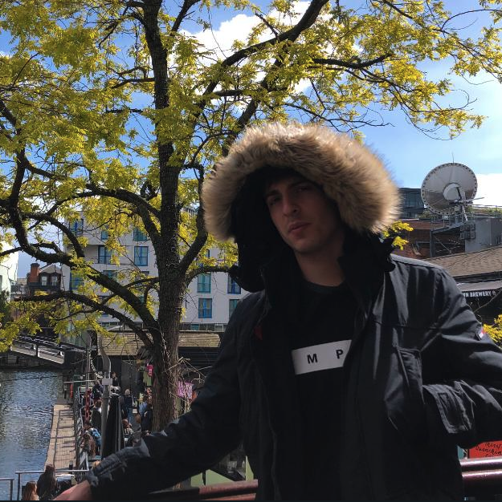

# 📈 BigDickBOT: a Telegram bot to create magic from a Goldshell KD5 📈

BigDickBOT will give some stats to the admins:

- Trade all your KDA and instantly convert them in USDT
- Retrieve for you some pool stats

<div align="center">
  <a href="https://github.com/TheBous">
    
  </a>
  <a href="https://github.com/TheBous">
    
  </a>
  <br>
  <br>
</div>

## Installation

- You need Node >= 12.20
- run 
```bash
yarn
```

## Using ENV

- Create your own .env and fill it with these values: 
```bash
API_SECRET=
API_PASSPHRASE=
API_KEY=
BOT_TOKEN=
```

## Start

Start it with 
```bash
yarn start
```

## Contributors

- Luca Valsecchi [@TheBous](https://github.com/TheBous)
- Lorenzo Tosetti aka 'El Puerco' [@tosettil-polimi](https://github.com/tosettil-polimi)

## License

MIT